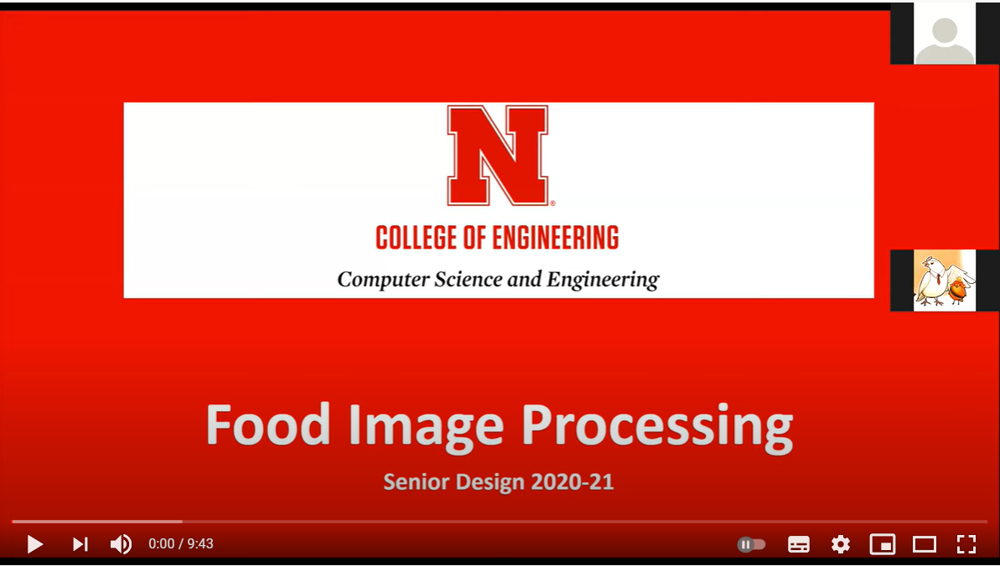
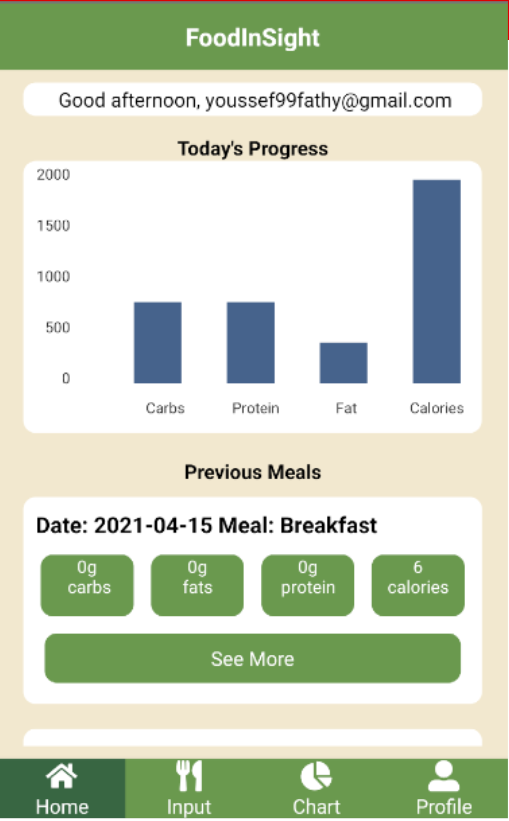
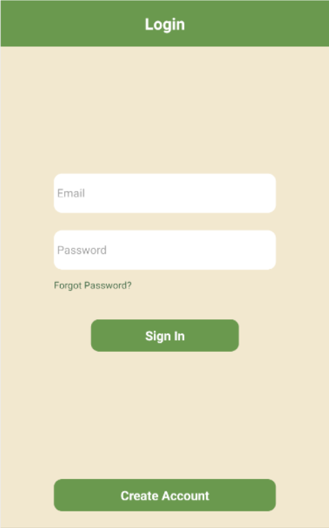
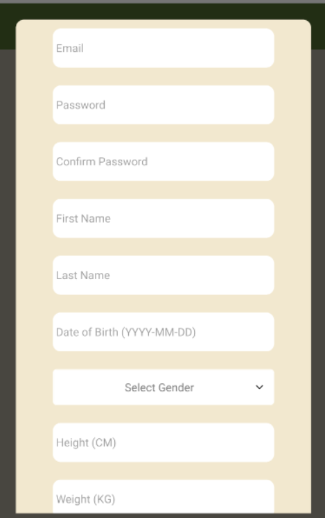
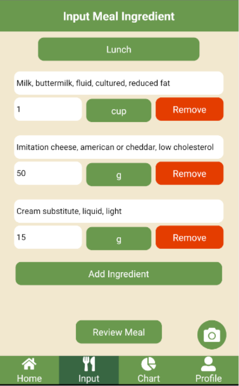
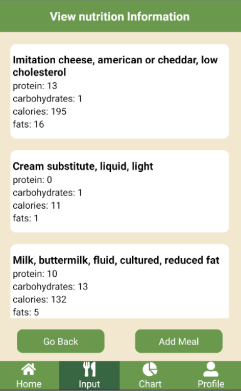
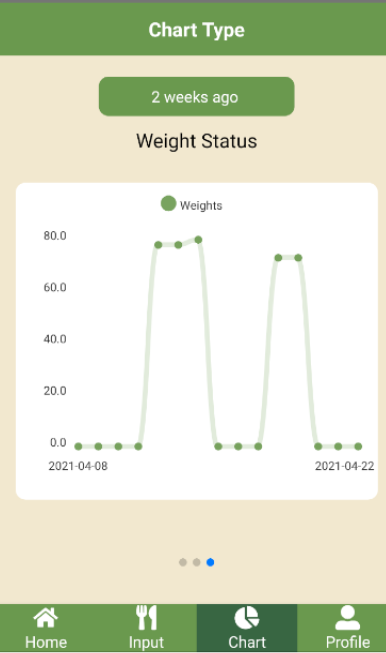
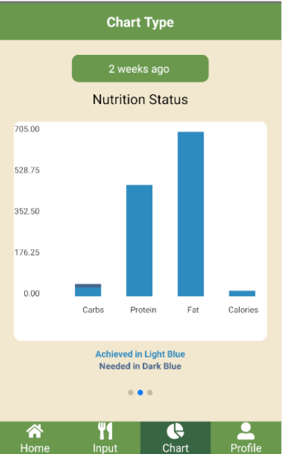
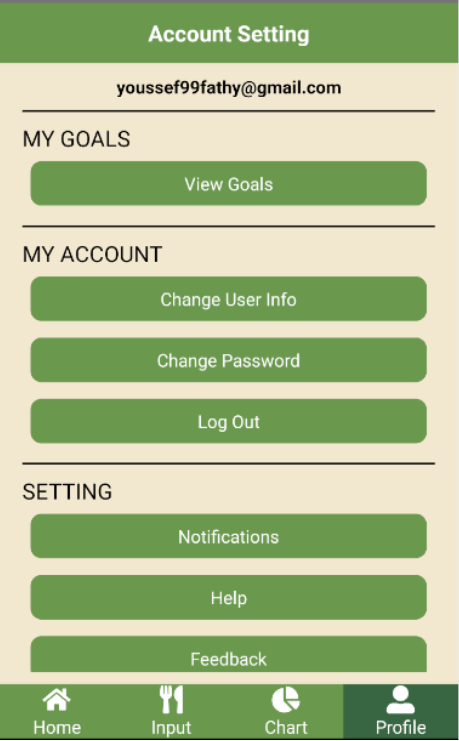
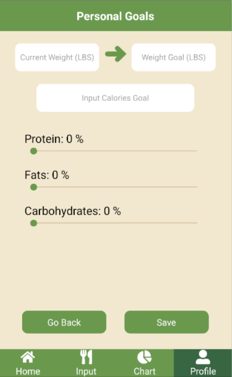

---

<h2 align="center">AI-based Food Image Processing (Cross-Platform Mobile Application)</h2>

<strong>Authors: Camden Obertop, Youssef Fathy, Alex Rechsteiner, Sarah Kornbluh, Nicholas Fong, Xinyi Zhu</strong>
  

- [Presentation](https://docs.google.com/presentation/d/1xrtzdUeHpZNyc29nFNYYq_JvOSlBg9w61ovdK2xRuw0/edit#slide=id.gd426522796_5_32)

[![Maintenance Status][maintenance-image]](#maintenance-status)

## Getting started / Installation

## **[Android APK](app-release.apk)**

## Problem

- Diet-related issues are causing obesity and metabolic comorbidities globally, and this phenomenon is prevalent in all age groups.
- Dietary self-monitoring is a labor-intensive process that requires tedious and lengthy input from a user.
- You can miss small ingredients when monitoring your diet daily, and these ingredients can add up.
- Enormous food diversity requires a comprehensive database and accurate food recognition

## Preview App

### Home Page

This page can be used to show a user info about what they have accomplished. It also displays a list of previous meals below a progress page with options to change the date.

### Login Page

This page is split up into several sections: One where a user can sign in to the application or request a password reset via a forgotten password button, and the next section where they can click a button to create an account. When the create account button is clicked, a popup appears asking for relevan t account information.

|      Login       |   Create account   |
| :--------------: | :----------------: |
|  |  |

### Input Page

The input page can be used to add meals a user eats. Ingredients can be added manually using the search bar, and a user can also add ingredients from an image by pressing the camera button in the lower right-hand corner of the screen. From there, a user can choose to upload an image or take one. This will then prompt the user for a grid screen where they can select a portion of the page for specific ingredients. Once the ingredients are selected, a user can press “review meal” and add that meal to their account from the review meal page.

Users also modify the meal type by selecting the dropdown menu to indicate (breakfast, lunch, dinner) meal type for each meal. Once the food image analysis is finished from the server returning predicting ingredients, a list of ingredients will be generated by the food image analysis. A lazy loading filter picker provides support to modify the list from the fcid list provided from the USDA table.

| Ingredients Selection | Nutrition Information |
| :-------------------: | :-------------------: |
|       |        |

### Charts Page

This page shows the user statistics over time represented by different graphs. The graphs include Calories Status, Nutrition Status, and Weight Status by swiping left and right. All the graphs have a selection of date ranges of 2 weeks, 1 month, 3 months, 6 months, and 1 year ago. It is default on 1 week ago for the date range.

|   Line Chart    |  Column chart  |
| :-------------: | :------------: |
|  |  |

### Profile

This page allows a user to view information and change it as well. A user can change their goals by selecting the change goals option. A user can also change some data they set up from their first time setup. These options can be changed in the View Goals, Change User Info, and Change Password sections.

|      Profile       |  Goal Setting   |
| :----------------: | :-------------: |
|  |  |

[maintenance-image]: https://img.shields.io/badge/maintenance-active-green.svg

# Live Demo
---

