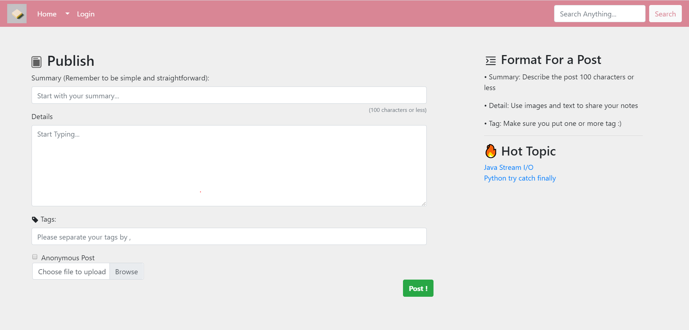
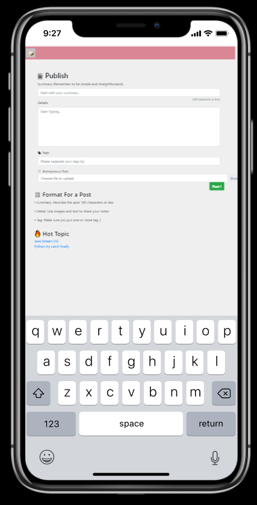

<!--
 * @Author: Xinyi Zhu
 * @Date: 2020-04-29 17:29:51
 * @Email: zhuxinyishcn@outlook.com
 * @GitHub: https://github.com/zhuxinyishcn
 * @Description: file info
 * @LastEditors: Xinyi Zhu
 * @LastEditTime: 2020-09-09 21:03:34
 -->
<h1 align="center"><a href="https://github.com/zhuxinyishcn/Rouge" target="_blank"><strong>📔Rouge</strong></a></h1>

> This a small community for user to share their notes and new discovery in the life

## Libraries && Implementation

> - [**SpringBoot**](https://spring.io/): Spring makes programming Java quicker, easier, and safer for everybody. Spring’s focus on speed, simplicity, and productivity has made it the world's most popular Java framework.
> - [**MyBatis**](https://mybatis.org/mybatis-3/index.html): MyBatis is a first class persistence framework with support for custom SQL, stored procedures and advanced mappings. MyBatis eliminates almost all of the JDBC code and manual setting of parameters and retrieval of results. MyBatis can use simple XML or Annotations for configuration and map primitives, Map interfaces and Java POJOs (Plain Old Java Objects) to database records.
> - [**H2 Database Engine**](https://www.h2database.com/html/main.html):  
>   1.Very fast, open source, JDBC API  
>   2.Embedded and server modes; in-memory databases  
>   3.Browser based Console application  
>   4.Small footprint: around 2 MB jar file size
> - [**OAuth**](https://oauth.net/2/): OAuth 2.0 is the industry-standard protocol for authorization. OAuth 2.0 focuses on client developer simplicity while providing specific authorization flows for web applications, desktop applications, mobile phones, and living room devices
> - [**BootStrap**](https://getbootstrap.com/): Build responsive, mobile-first projects on the web with the world’s most popular front-end component library.
> - [**Google cloud Platform**](https://cloud.google.com/): Google cloud Platform: Geocoding API web service is easy to use Take advantage of the Big data that google have
> - [**OkHttp**](https://square.github.io/okhttp/): HTTP is the way modern applications network. It’s how we exchange data & media. Doing HTTP efficiently makes your stuff load faster and saves bandwidth.
> - [**Gson**](https://sites.google.com/site/gson/gson-user-guide): It help us better manage the Http response after we sent the get request to Google cloud
> - [**JUnit**](https://junit.org/junit5/): JUnit is helpful Library t o design and implement a test suite
> - [**Lombok**](https://projectlombok.org/): Project Lombok is a java library that automatically plugs into your editor and build tools, spicing up your java.
> - [**Flyway**](https://projectlombok.org/): Version control for your database.Robust schema evolution across all your environments.With ease, pleasure and plain SQL.

## Instructions to build and run the program

## Description

This a small community for users to share their notes and new discovery in life. This is also my first SpringBoot Application and trying to make it publish to both websites and mobile platforms.

## Preview

### Browsers

### Mobile device

